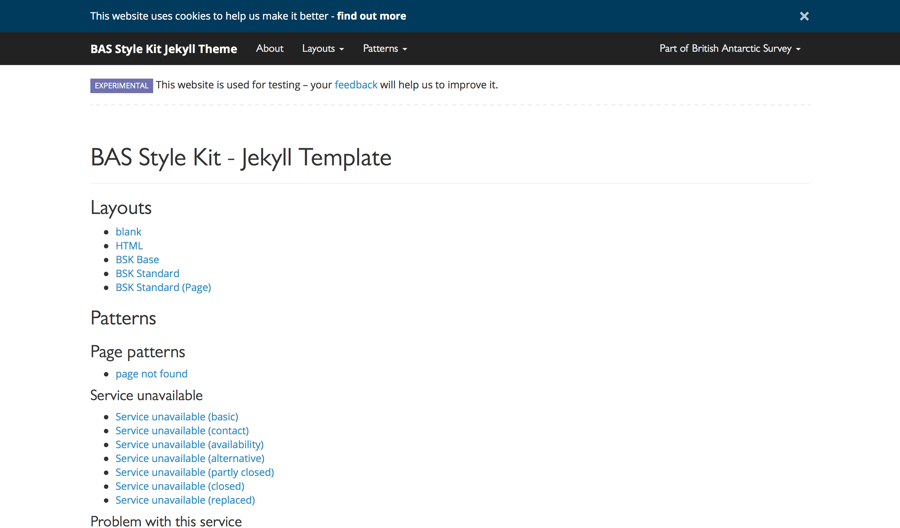

# BAS Style Kit Jekyll Theme

Jekyll theme for the [BAS Style Kit](https://style-kit.web.bas.ac.uk).



## Installation

Add this line to your Jekyll site's `Gemfile`:

```ruby
gem "jekyll-theme-bas-style-kit"
```

And then execute:

```shell
$ bundle
```

Or install it yourself as:

```shell
$ gem install jekyll-theme-bas-style-kit
```

Finally, to use the theme, add this line to your `_config.yml` file:

```yaml
theme: jekyll-theme-bas-style-kit
```

## Usage

Refer to [Jekyll's theme documentation](https://jekyllrb.com/docs/themes/) for general information.

### Quick start

Add these lines to your `_config.yml` file:

```yml
bas_style_kit_jekyll_theme:
  attributes:
    head_title:
      default: 'Example service'
      appended: ' - Example service'
    head_description: 'Service to act as an example'
    site_brand:
        text: 'Example service'
        href: '/'
    site_development_phase: 'beta'
    site_feedback_href: '/feedback'
    legal_policies:
      cookies_href: '/legal/cookies'
      copyright_href: '/legal/copyright'
      privacy_href: '/legal/privacy'
    # Optional - add a custom CSS file with a relative URL
    site_styles:
        -
          href: '/css/main.css'
          type: 'local'
    # Optional - add a custom JS file with a SRI value
    site_scripts:
        -
          href: 'https://example.com/js/example.js'
          integrity: 'abc123'
          type: 'remote'
    # Optional - enable web analytics
    site_analytics:
      id: '1234'
    # Optional - choose between the `bsk-container` and `bsk-container-fluid` layout container
    container: 'bsk-container'
```

To optionally add navigation menu items, add these lines to `_data/menus.yml`:

```
site_navigation_primary:
  - url: '#'
    title: 'Item'

site_navigation_launcher:
  - url: 'https://www.bas.ac.uk'
    title: BAS Home
    weight: 1
  - url: 'https://example.com'
    title: Related service
    weight: 3
```

#### Standard page

To create a page in an application or website based on the standard BAS page structure, create an application layout 
(e.g. `_layouts/app.html`) with the following:

```
---
layout: layouts/bas-style-kit/bsk--standard.html
---
```

To base all pages this layout add these lines to your `_config.yml` file:

```yml
defaults:
  -
    scope:
      # An empty string here means all files in the project
      path: ""
    values:
      layout: "app"
```

#### Use a page pattern

To create a page in an application or website based on a [page design pattern](#page-patterns), create a view 
(e.g. `views/error.pug`) with the following:

```html
---
layout: views/bas-style-kit/[page-pattern]
---
```

Where `[page-pattern]` in the extends value is the name of a page pattern, for example:

```html
---
layout: views/bas-style-kit/bsk--page-not-found
---
```

### Patterns

Design patterns are used to demonstrate preferred ways to pass on information to users, or ask them for information.
For example, information to show when a service is unavailable, formatting dates consistently or asking users for their
username in a consistent way. See the [Style Kit documentation](https://style-kit.web.bas.ac.uk/patterns) for more 
information.

These patterns are implemented by this theme based on the reference examples included in the Style Kit. These 
include patterns for:

* [pages](#page-patterns) - standalone pages designed to be used without customisation, defined as [Views](#views)

#### Page patterns

These template include [Views](#views) for all page patterns. In most cases all variants of a pattern use the same view,
but with different options using variables and/or page content.

See the [Style Kit documentation](https://style-kit.web.bas.ac.uk) for general information on using these patterns.

##### 'page not found' pattern

No configuration options.

##### 'service unavailable' pattern

Use page content for:

* contact information

Optionally, use page content for:

* details of alternative services

Optionally, use a `pattern_availability` page variable for setting the availability line:

* a value of `closed` will show conventional text
* a value of `replaced` will show conventional text
* no value will show conventional text

##### 'problem with this service' pattern

Use page content for:

* contact information

Optionally, use page content for:

* details of alternative services

##### 'start' pattern

Use page content for:

* a list of needs the service caters for, as a list wrapped in a section with the `bsk-service-uses` class [1]
* a call to action, as a link wrapped in a section with the `bsk-call-to-action` class [2]
  * if the call to action should be a 'Sign in to start' button use [3]
* contact information, as text wrapped in a section with the `bsk-more-information` class [4]

Optionally, use page content for:

* 'before you start' information, wrapped in a section with the `bsk-before-you-start` class [5]

**Note:** If not already included via a layout, include
[Font Awesome](https://style-kit.web.bas.ac.uk/core/icons/#font-awesome) to show the ORCID symbol.

[1]

```html
<section class="bsk-service-uses">
    <h2 class="bsk-h3">Use this service to:</h2>
    <ul>
        <li>access some information</li>
        <li>perform an action</li>
        <li>etc.</li>
    </ul>
</section>
```

[2]

```html
<section class="bsk-call-to-action">
    <a class="bsk-btn bsk-btn-primary bsk-btn-lg" href="#">
        Start Now
        <i class="fa-fw fas fa-chevron-right"></i>
    </a>
</section>
```

[3]

```html
<section class="bsk-call-to-action">
    <button class="bsk-btn bsk-btn-ms-account bsk-btn-lg">
        <object class="bsk-ms-pictogram" type="image/svg+xml" data="https://cdn.web.bas.ac.uk/bas-style-kit/{{ site.data.bas-style-kit.bsk-vars.bsk_version }}/img/logos-symbols/ms-pictogram.svg"></object>
        Sign in to start
        <i class="fa-fw fas fa-chevron-right"></i>
    </button>
    <p class="bsk-sign-in-hint bsk-text-muted">Use the account you use for your NERC email to sign into this service.</p>
</section>
```

[4]

```html
<section class="bsk-more-information">
    <h2 class="bsk-h3">More information</h2>
    <p>Contact the <a href="#">Sample Team</a> for information and help on how to use [website or application].</p>
</section>
```

[5]

```html
<section class="bsk-before-you-start">
    <h2 class="bsk-h3">Before you start</h2>
    <p>You need some information to use this service.</p>
</section>
```

##### 'sign in' pattern

Use page content for:

* a call to action, as a page variable [1]

```html
---
layout: views/bas-style-kit/bsk--sign-in-microsoft

call_to_action_href: #
---
```

### Using custom CSS/JS

Support is provided for loading additional CSS an/or JavaScript resources, such as application or website specific 
styling or interactivity, either as references to files.

This support is available in all layouts which inherit from the `bsk--basic.html` layout.

For file resources, variables are provided for adding URLs and optional SRI values. Files will be included in the 
relevant block automatically, after the Style Kit's own resources if a Style Kit layout is used.

* CSS resources are outputted at the end of the `<head>` element
* JS resources are outputted at the end of the `<body>` element

Add these lines to your `_config.yml` file:

```yml
bas_style_kit_jekyll_theme:
  attributes:
    site_styles:
        -
          href: '/css/main.css'
          type: 'local'
    site_scripts:
        -
          href: 'https://example.com/js/example.js'
          integrity: 'abc123'
          type: 'remote'
```

#### Resource objects

Resource objects have the following properties:

| Property    | Data Type | Required | Allowed Values      | Example Value                                          |
| ----------- | --------- | -------- | ------------------- | ------------------------------------------------------ |
| `href`      | String    | Yes      | Any URL             | `/css/app.css` / `https://example.com/js/app.js`       |
| `type`      | String    | Yes      | `local` or `remote` | `local`                                                |
| `integrity` | String    | No       | Any SRI value       | `sha256-ClILH8AIH4CkAybtlKhzqqQUYR4eSDiNTK5LIWfF4qQ=`  |

The `integrity` property is used to specify a 
[Subresource Integrity (SRI)](https://developer.mozilla.org/en-US/docs/Web/Security/Subresource_Integrity) value for 
a resource. If specified an `integrity` attribute and will be added to the generated markup. A `crossorigin` 
attribute will also be added for 
[Cross-Origin Resource Sharing (CORS)](https://developer.mozilla.org/en-US/docs/Web/HTTP/CORS) support with a 
hard-coded, `anonymous`, value. 

### Navigation menu items

When using the `bsk--standard.html` layout, a [navbar](https://style-kit.web.bas.ac.uk/components/navbar/) is included 
as part of the 'standard header', which consists of a cookie banner, navbar and site development phase banner.

This navbar consists of three menus (and other elements, documented elsewhere):

1. a primary navigation menu - aligned left, after [brand elements](#navigation-branding)
2. a secondary navigation menu - aligned right, before the launcher menu
3. a navigation launcher menu - aligned right, after the secondary navigation menu

The navigation launcher is a restricted menu, used to link to other BAS websites and applications. By default it 
contains links to the [BAS public website](https://www.bas.ac.uk) and the [BAS data catalogue](https://data.bas.ac.uk). 
Other websites and applications can be added as well where relevant.

The primary and secondary navigation menu's support:

* [navbar items](https://style-kit.web.bas.ac.uk/components/navbar/#item)
* [navbar drop-down menus](https://style-kit.web.bas.ac.uk/components/navbar/#drop-down-menus)
* [navbar drop-down menu items](https://style-kit.web.bas.ac.uk/components/navbar/#drop-down-menus)

The navigation launcher menu, which is implemented as a drop-down menu, supports:

* [navbar drop-down menu items](https://style-kit.web.bas.ac.uk/components/navbar/#drop-down-menus)

All navigation menus are implemented using the [Jekyll menus](https://github.com/forestryio/jekyll-menus) plugin.

* primary navigation menu items should be added to the `site_navigation_primary` menu
* secondary navigation menu items should be added to the `site_navigation_secondary` menu
* navigation launcher menu items should be added to the `site_navigation_launcher` menu

**Note:** Menu items are only recursed once, deeper objects will be ignored.

### Navigation branding

[Navbars](https://style-kit.web.bas.ac.uk/components/navbar/) are also used to display the name/identity of a website 
or application, to remind users where they are. These elements are referred to as 'brand' elements within the Style Kit.

In the 'standard header', navbar brand elements are shown on the far left. 

Supported brand elements:

* [brand text](https://style-kit.web.bas.ac.uk/components/navbar/#brand-text) - set using the 
`bas_style_kit_jekyll_theme.attributes.site_brand.text` config variable
* [brand image](https://style-kit.web.bas.ac.uk/components/navbar/#brand-image) - set using the 
`bas_style_kit_jekyll_theme.attributes.site_brand.img` config variable

Brand elements can be used together or individually, with fix classes applied automatically as needed. 

Brand elements are linked to a location specified by the `bas_style_kit_jekyll_theme.attributes.site_brand.href` config 
variable, which should be the index of each website or application (i.e. `/`).

### Site development phase

The site development phase reflects the stage of development for a website or application, e.g. alpha or live. They are
described in the Style Kit [here](https://style-kit.web.bas.ac.uk/core/colours/#development-phase-colours).

For websites or applications that are not firmly in the 'live' phase, a banner should be shown to inform users and 
request feedback. This forms part of the 'standard header' of cookie banner, navbar and site development phase banner.

In these templates, the `bas_style_kit_jekyll_theme.attributes.site_development_phase` config variable is used to 
specify the current phase for a website or application. When using the `bsk--standard.html`layout, a banner will be 
shown automatically based on this variable.

To disable this banner, set the `bas_style_kit_jekyll_theme.attributes.site_development_phase` config variable to 
`live-stable`. This isn't a real phase but separates a newly released website or application from something more mature.

For example:

```yml
bas_style_kit_jekyll_theme:
  attributes:
    site_development_phase: 'alpha'
```

#### Experimental development phase

Alternatively, the `bas_style_kit_jekyll_theme.attributes.site_development_phase` config variable can be set to 
`experimental` to indicate where an website or application is used for staging or other development/testing activities.

For example:

```yml
bas_style_kit_jekyll_theme:
  attributes:
    site_development_phase: 'experimental'
```

### Website analytics

To include the Google Analytics universal tracking library (gtag), set the 
`bas_style_kit_jekyll_theme.attributes.site_analytics.id` property to relevant Google Analytics property ID.

**Note:** When used, the anonymise IP option in Google Analytics is enabled by default.

For example:

```yml
bas_style_kit_jekyll_theme:
  attributes:
    site_analaytics:
      id: '123abc'
```

## Components

Components in these templates are structured according to Jekyll's conventions (e.g. layouts in `_layouts/`). They are 
also namespaced in a `bas-style-kit` directory (e.g. `_layouts/bas-style-kit/`). Components that are specific to the 
Style Kit are prefixed with `bsk--`.

### Views

Views are used for implementing [page patterns](#page-patterns). They are essentially layouts but with predefined page
content relevant to each pattern.

Within Jekyll, views are implemented as layouts. To use a view, create a page with the relevant 'view' layout.

```
---
layout: views/bas-style-kit/page-not-found
---
```

Views for some pattern variants can be used as-is, others require variables or page content to be set as well. See the
[Page patterns](#page-patterns) section for more information.

### Layouts

Refer to [Jekyll's documentation](https://jekyllrb.com/docs/layouts/) for general information.

Layouts are 'base' templates from which views or other layouts inherit. Layouts in this theme are hierarchical, with 
each layout extending the last in this order:

* `blank.html`: lowest level layout, intentionally as minimal as possible and not intended for direct use, unless
  non-HTML output is needed
* `html.html`: defines a minimal, accessible, HTML5 structure with some recommended best practices for cross-platform
  compatibility
* `bsk--base.html`: intentionally implements the BAS Style Kit as minimally as possible and not intended for direct use,
  unless the bsk_standard.j2 layout is unsuitable
* `bsk--standard.html`: defines an opinionated, conventional, page layout with a 'standard' header/footer, recommended 
  as a base for application/website layouts
* `bsk--standard-page.html`: defines an opinionated, conventional, content page layout, recommended as a base for 
  content type websites, such as documentation

For example:

```markdown
---
layout: bas-style-kit/html
---

Page content
```

Layouts inheriting from the `bsk--standard` layout can add additional classes to the `#main-content` element by setting 
the `main_content_classes` variable in each layout.

For example:

```markdown
---
layout: bas-style-kit/bsk--standard
main_content_classes: foo
---

Page content
```

### Includes

Refer to [Jekyll's documentation](https://jekyllrb.com/docs/includes/) for general information.

This theme uses includes extensively to give fine grained control over how elements such as the navbar behave, including
both their content and structure.

Includes are often used conditionally using a related configuration option, to be disabled more easily.

### Data files

Refer to [Jekyll's documentation](https://jekyllrb.com/docs/datafiles/) for general information.

This theme uses data files to define CSS and JavaScript resources to load and for some variables about the theme.

All data files use the `.yml` (Yaml) extension and are namespaced using a `bas-style-kit/` directory - i.e. a data 
element `foo` in the data file `bsk-vars.yml` is available as `site.data.bas-style-kit.bsk-vars.foo`.

### Variables

Refer to [Jekyll's documentation](https://jekyllrb.com/docs/variables/) for general information.

#### Style Kit specific variables

| Variable        | Fully Qualified Variable                         | Purpose                                         | Example | Notes |
| --------------- | ------------------------------------------------ | ----------------------------------------------- | ------- | ----- |
| `theme_version` | `site.data.bas-style-kit.bsk-vars.theme_version` | Version of this theme                           | `0.3.0` | -     |
| `bsk_version`   | `site.data.bas-style-kit.bsk-vars.bsk_version`   | Version of the Style Kit used within this theme | `0.3.0` | -     |

### Configuration options

Refer to [Jekyll's documentation](https://jekyllrb.com/docs/configuration/) for general information.

Configuration options are used extensively throughout this theme. Some variables are used to set properties such as the
brand text or image in the navbar (attributes), others are used to enable various features (feature flags).

Configuration options operate at different scopes, *site* or *page*. Site options applies to across a site, whereas 
page options can be applied to specific content items. Default values can be set for page options, which can then be
overridden by specific content items.

Configuration options for this theme are namespaced under a `bas_style_kit_jekyll_theme` option - i.e. an option `foo`
is set as `bas_style_kit_jekyll_theme.foo`.

Configuration options in this documentation use a dot notation to indicate a nested structure - i.e. an option `foo.bar`
should be set as:

```yml
foo:
  bar
```

A configuration option `bas_style_kit_jekyll_theme.feature_flags.site.back_to_top_anchor` should be set as:

```yml
bas_style_kit_jekyll_theme:
  feature_flags:
    site:
      back_to_top_anchor: '[value]'
```

These config options can be set at a page, collection or site level:

* `bas_style_kit_jekyll_theme.feature_flags.page.toc`

These config options should be changed or set for each website or application:

* `bas_style_kit_jekyll_theme.attributes.head_title.default`
* `bas_style_kit_jekyll_theme.attributes.head_title.appended`
* `bas_style_kit_jekyll_theme.attributes.head_description`
* `bas_style_kit_jekyll_theme.attributes.site_analytics.id`
* `bas_style_kit_jekyll_theme.attributes.site_brand.text`
* `bas_style_kit_jekyll_theme.attributes.site_development_phase`
* `bas_style_kit_jekyll_theme.attributes.site_feedback_href`
* `bas_style_kit_jekyll_theme.attributes.site_footer.legal_policies.cookies_href`
* `bas_style_kit_jekyll_theme.attributes.site_footer.legal_policies.copyright_href`
* `bas_style_kit_jekyll_theme.attributes.site_footer.legal_policies.privacy_href`

These config options may, but don't need to be, changed or set for each website or application:

* `bas_style_kit_jekyll_theme.attributes.container`
* `bas_style_kit_jekyll_theme.attributes.site_styles`
* `bas_style_kit_jekyll_theme.attributes.site_scripts`
* `bas_style_kit_jekyll_theme.attributes.head_favicon`
* `bas_style_kit_jekyll_theme.attributes.site_brand.img`
* `bas_style_kit_jekyll_theme.attributes.site_brand.href`

These config options do not normally, and should not, need to be changed or set:

* `bas_style_kit_jekyll_theme.attributes.site_back_to_top_target_href`
* `bas_style_kit_jekyll_theme.attributes.site_footer.ogl.href`
* `bas_style_kit_jekyll_theme.attributes.site_footer.ogl.version`

These config options must not be changed and should be treated as read only:

* `site.data.bas-style-kit.bsk-vars.theme_version`
* `site.data.bas-style-kit.bsk-vars.bsk_version`

| Config Option                                                                     | Value Type | Allowed Values                                                                                  | Default Value      | Notes                                                      |
| --------------------------------------------------------------------------------- | ---------- | ----------------------------------------------------------------------------------------------- | ------------------ | ---------------------------------------------------------- |
| `bas_style_kit_jekyll_theme.feature_flags.page.toc`                               | Boolean    | `true` / `false`                                                                                | `true`             | Whether to show the table of contents in standard pages    |
| `bas_style_kit_jekyll_theme.attributes.head_title.default`                        | String     | Any string                                                                                      | 'site title'       | Typically 1-3 words                                        | 
| `bas_style_kit_jekyll_theme.attributes.head_title.appended`                       | String     | Any string                                                                                      | *None*             | Typically 1-3 words                                        | 
| `bas_style_kit_jekyll_theme.attributes.head_description`                          | String     | Any string                                                                                      | 'site description' | Typically 1-2 sentences                                    | 
| `bas_style_kit_jekyll_theme.attributes.site_analytics.id`                         | String     | Google Analytics property ID                                                                    | *None*             | See [Site analytics](#site-analytics)                      | 
| `bas_style_kit_jekyll_theme.attributes.site_brand.text`                           | String     | Any string                                                                                      | 'site title'       | Typically 1-3 words                                        | 
| `bas_style_kit_jekyll_theme.attributes.site_development_phase`                    | String     | `discovery` / `alpha` / `beta` / `live` / `live-stable` / `retired` / `experimental` / `custom` | 'alpha'            | See [Site development phase](#site-development-phase)      |
| `bas_style_kit_jekyll_theme.attributes.site_feedback_href`                        | String     | URL to feedback page or other content (e.g. model overlay)                                      | '/feedback.html'   | -                                                          |
| `bas_style_kit_jekyll_theme.attributes.site_footer.legal_policies.cookies_href`   | String     | URL to cookies legal policy                                                                     | '/legal/cookies'   | -                                                          |
| `bas_style_kit_jekyll_theme.attributes.site_footer.legal_policies.copyright_href` | String     | URL to copyright legal policy                                                                   | '/legal/copyright' | -                                                          |
| `bas_style_kit_jekyll_theme.attributes.site_footer.legal_policies.privacy_href`   | String     | URL to privacy legal policy                                                                     | '/legal/privacy'   | -                                                          |
| `bas_style_kit_jekyll_theme.attributes.container`                                 | String     | `fixed` / `fluid`                                                                               | 'fixed'            | -                                                          |
| `bas_style_kit_jekyll_theme.attributes.site_styles`                               | Array      | Site style object                                                                               | *Empty array*      | See [Using custom CSS/JS](#using-custom-cssjs)             |
| `bas_style_kit_jekyll_theme.attributes.site_scripts`                              | Array      | Site script object                                                                              | *Empty array*      | See [Using custom CSS/JS](#using-custom-cssjs)             |
| `bas_style_kit_jekyll_theme.attributes.head_favicon`                              | String     | `default`                                                                                       | 'default'          | The favicon to use, use 'default' the standard BAS favicon |
| `bas_style_kit_jekyll_theme.attributes.site_brand.img`                            | String     | URL to image                                                                                    | *None*             | See [Navigation menu branding](#navigation-menu-branding)  |
| `bas_style_kit_jekyll_theme.attributes.site_brand.href`                           | String     | URL to content                                                                                  | '/'                | See [Navigation menu branding](#navigation-menu-branding)  |
| `bas_style_kit_jekyll_theme.attributes.site_back_to_top_target_href`              | String     | CSS ID selector                                                                                 | '#site-top'        | -                                                          |
| `bas_style_kit_jekyll_theme.attributes.site_footer.ogl.href`                      | String     | URL to OGL information page                                                                     | *As implemented*   | -                                                          |
| `bas_style_kit_jekyll_theme.attributes.site_footer.ogl.version`                   | String     | Any OGL version                                                                                 | *As implemented*   | -                                                          |
| `site.data.bas-style-kit.bsk-vars.theme_version`                                  | String     | Any [SemVer](https://semver.org/) value                                                         | *As implemented*   | -                                                          |
| `site.data.bas-style-kit.bsk-vars.bsk_version`                                    | String     | Any BAS Style Kit version                                                                       | *As implemented*   | -                                                          |

### Plugins

This theme depends on these plugins:

* [Jekyll data](https://github.com/ashmaroli/jekyll-data) - for including theme data files into a site's configuration
* [Jekyll menu](https://github.com/forestryio/jekyll-menus) - for managing navigation menus
* [Jekyll tidy](https://github.com/apsislabs/jekyll-tidy) - for rewriting HTML output to be well structured

## Development

[Git](https://git-scm.com), [Docker](https://www.docker.com/community-edition) and 
[Docker Compose](https://docs.docker.com/compose/overview/) are required to build this project locally.

To update the Docker image for this project, access to the private 
[BAS Docker Registry](https://docker-registry.data.bas.ac.uk) [1] is also required.

```shell
$ git clone https://gitlab.data.bas.ac.uk/web-apps/bsk/bas-style-kit-jekyll-theme.git
$ cd bas-style-kit-jekyll-theme
$ docker-compose up
```

Visit [localhost:9000](http://localhost:9000) to see a preview of the theme.

**Note:** If you don't have access to the BAS Private Docker Registry, you will need to build the project Docker image 
locally first using `docker-compose build`.

[1] The first time you use this registry, you will need to authenticate using:

```shell
$ docker login docker-registry.data.bas.ac.uk
```

### Updating dependencies

If the `.gemspec` for this project is changed, the project Docker image will need to be rebuilt and pushed to the 
private BAS Docker Repository [1].

```shell
$ docker-compose build app
$ docker-compose push app
```

[1] The first time you use this registry, you will need to authenticate using:

```shell
$ docker login docker-registry.data.bas.ac.uk
```

#### Dependency vulnerability scanning

To ensure the security of this project, and users of the Style Kit, all dependencies are checked against
[Snyk](https://app.snyk.io/org/antarctica/project/a409ca29-86a3-45de-9838-5f1d7d1aca12) for vulnerabilities.

Through [Continuous Integration](#continuous-integration), on each commit current dependencies are tested and a 
snapshot uploaded to Snyk. This snapshot is then monitored for vulnerabilities.

### Jekyll plugins

Additional Jekyll plugins (gems) can be used by listing them as dependencies in the `gems` option in `_config.yml`.

They will be installed automatically when this theme is used by an end-user.

### Jekyll config options

The Jekyll Data plugin is used to set config options within sites that use this theme. Make sure to document which 
config options are set by this theme.

### Ruby Gem

This theme is distributed as a Ruby Gem, through the public [Ruby Gems](https://rubygems.org) gem hosting service.

The `jekyll-theme-bas-style-kit.gemspec` file details the properties of the Gem for this project.

**Note:** The `spec.files` parameter controls which files in this project are copied into the Gem. If a file is not 
listed it won't be included. This is separate to the Git `.gitignore` file.

## Testing

### Continuous Integration

The BAS GitLab instance is used for Continuous Integration using settings defined in `.gitlab-ci.yml`.

## GitHub mirror

A read-only mirror of this project's repository is maintained on GitHub, to support Jekyll's automatic theme 
installation, and to allow use by those outside of BAS.

Merge requests **WILL NOT** be accepted on this mirror.

## Release procedures

Before release:

1. create a release branch
2. remove `-develop` from the version in:
  * `jekyll-theme-bas-style-kit.gemspec`
  * `_data/bsk_jekyll_vars.json`
3. build and push the app docker image [1]
4. if new config options have been set, update the usage section
5. update screen-shot (width: 900px)
6. close release in changelog
7. commit changes, merge with master and tag with new version
8. push the release to Ruby Gems [2]

**Note:** If the BAS Style Kit version changes, make sure to bump that version in `_data/bsk_jekyll_vars.json` too.

After release:

1. bump the version with `-develop` as a prefix in:
  * `jekyll-theme-bas-style-kit.gemspec`
  * `_data/bsk_jekyll_vars.json`
2. push the app docker image [1]
3. commit changes, merge with master and close release branch

[1]

```shell
$ docker-compose build
$ docker-compose push
```

[2]

```shell
$ docker-compose run --entrypoint="" app ash
$ gem build jekyll-theme-bas-style-kit.gemspec
$ gem push jekyll-theme-bas-style-kit-*.gem
```

## Issue tracking

This project uses [issue tracking](https://trello.com/b/0Mhzizpk/bas-style-kit) to manage development of new 
features/improvements and reporting bugs.

## Feedback

The maintainer of this project is the BAS Web & Applications Team, they can be contacted through the 
[BAS Service Desk](mailto:servicedesk@bas.ac.uk).

## License

© UK Research and Innovation (UKRI), 2017-2018, British Antarctic Survey.

You may use and re-use this software and associated documentation files free of charge in any format or medium, under 
the terms of the Open Government Licence v3.0.

You may obtain a copy of the Open Government Licence at http://www.nationalarchives.gov.uk/doc/open-government-licence/
